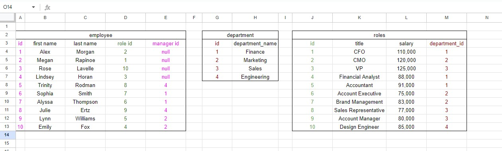
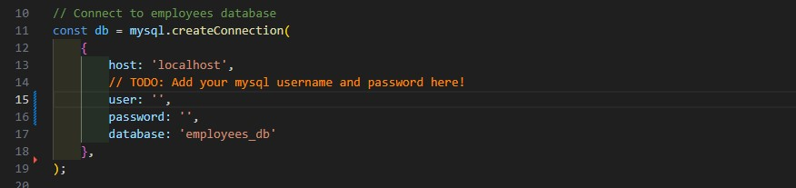
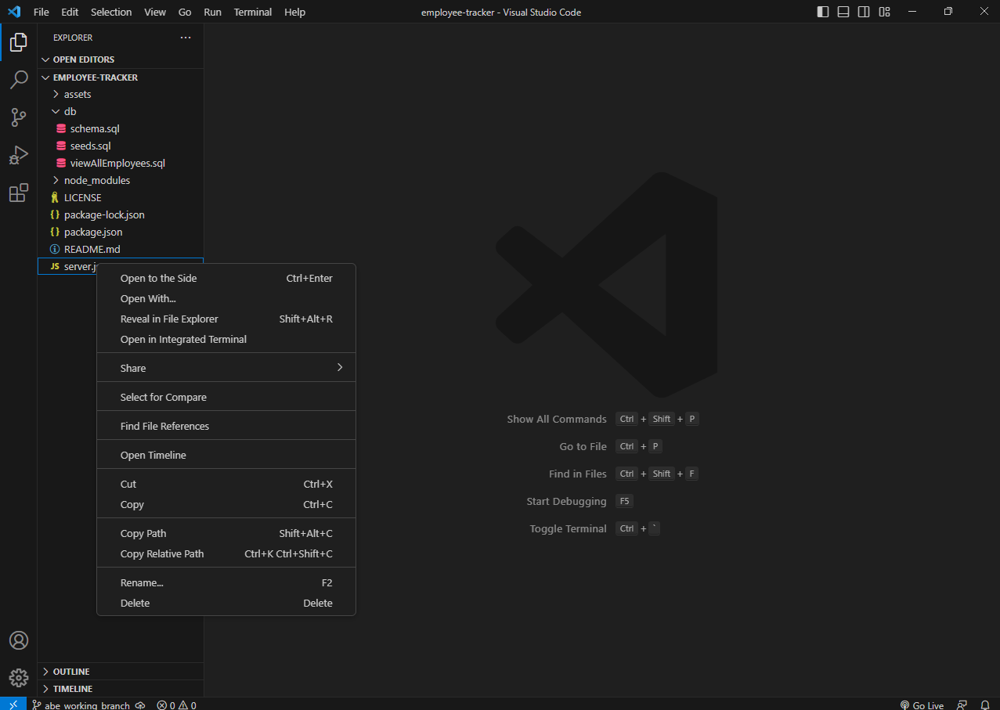
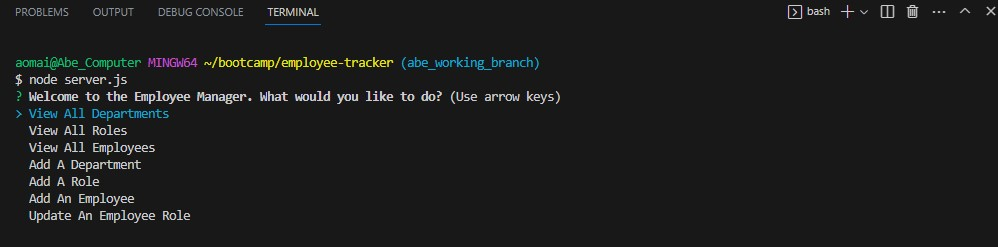
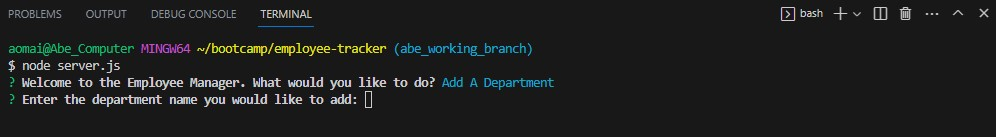
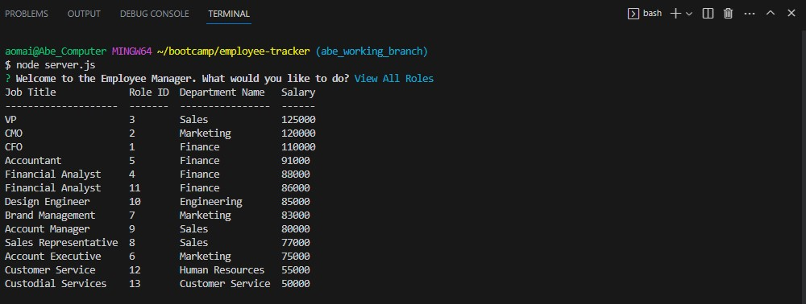

# Employee Tracker

## Description
This back-end application allows a user to manipulate queries to a SQL employee database. This project was created to give the user the ability to interact with employee data in a simple manner. 

This project allowed me to practice setting up a node server and querying a SQL database using MySQL. 

Below is the layout of the database I created for the project. I color-coded the connected foreign-primary keys for clarity: 

## Installation
As the project reliews on several key node packages, users will have to download all node packages before initiating. 

The connection configuration for the server is currently based on MySQL- if users wish to use the existing connection they will have to have an available MySQL username and password and add both to the server.js file (comments have been added to the server file for clarity). 

## Usage
To begin, the user will have to open the integrated terminal and use node to open the server.js file. 

The user will be greeted and the main menu will open. 

The user will then receive a prompt for seven different options. When selecting a course of action that will affect the data in the database, further questions will be asked of the user. 

When the user has completed all questions, they will either see a table showing the results of their queries or will be notified that the changes they'd requested have been made. 

A video demo of this application in action can be found [here](https://drive.google.com/file/d/1fWT9rRHT4PpGGIFg00dMnOx8QYEfQ89X/view).

## Credits 

The following NPM packages were used for this project: 
- inquirer v8.2.4
- mysql2 v3.5.2
- console.table v0.10.0
- filesystem v1.0.1

## License
A [MIT license](https://github.com/aomaits/employee-tracker/blob/main/LICENSE) was used for this project. 